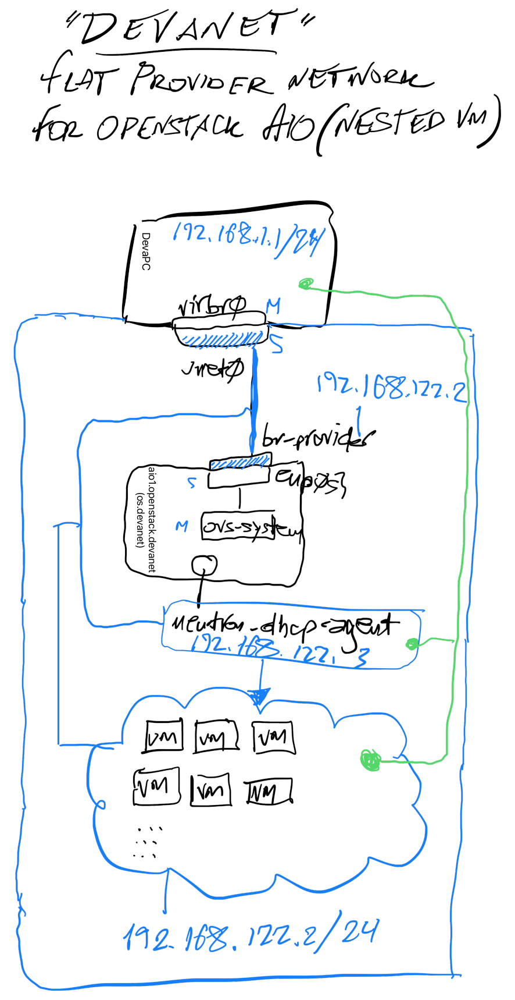

# DevaNet

Initially, it runs on the `libvirt` default NAT-based bridge network **192.168.122.0/24** , on DevaPC (the base physical host).

Currently, the config is per default, as we can check with `virsh net-dumpxml default` which dumps the following:

```xml
<network>
  <name>default</name>
  <uuid>728bf3de-57c2-4d7a-b84a-a1642245bcd1</uuid>
  <forward mode='nat'>
    <nat>
      <port start='1024' end='65535'/>
    </nat>
  </forward>
  <bridge name='virbr0' stp='on' delay='0'/>
  <mac address='52:54:00:12:f2:fe'/>
  <ip address='192.168.122.1' netmask='255.255.255.0'>
    <dhcp>
      <range start='192.168.122.2' end='192.168.122.254'/>
    </dhcp>
  </ip>
</network>
```

The setup also includes 2 Docker containers, a DNS server (with Bind9) and an LDAP server, that run on the base host, and are reachable from this net, as well. The purpose of the DNS server is for ease of addressing and the LDAP server is also meant to provide a unified auth account base for easy usage across various applications.

## Diagram



## Base Host - DevaPC

### Specs
```
Intel(R) Core(TM) i7-5820K CPU @ 3.30GHz
Memory speed: (4 x 8192 MB) @ 2133 MT/s each
```
### Connection details
This is using NetworkManager via Netplan to manage networking so we can use the following command to check details:
```
nmcli connection show Wired\ connection\ 1
```
```
Hostname: DevaPC
OS: Ubuntu 22.04 Jammy
IP CIDR: 192.168.1.1/24
Gateway: 192.168.1.254
DNS: 192.168.1.254
```
## Base VM with Openstack AIO

### Specs

- CPU: 8
- Memory: 24GB

### Connection details

```
Hostname: os.devanet
OS: Ubuntu Server 22.04.2 LTS
IP CIDR: 192.168.122.2/24
Gateway: 192.168.122.1
DNS: 192.168.122.1
```
