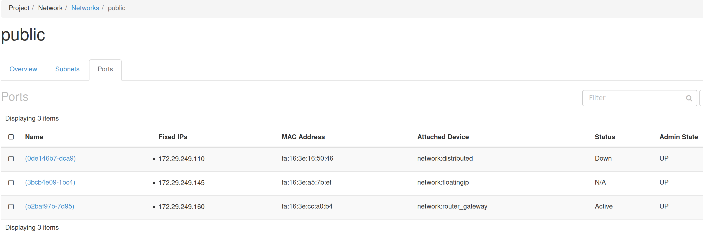

# Enable Domains

In Horizon, the Domains UI component seems to be inactive... First, you configure the Identity to be able to use the LDAP driver, add your own LDAP config, and enable the UI view in Horizon.

---

In `/etc/keystone/keystone.conf` add only the following:

```
[identity]
...
domain_specific_drivers_enabled = True
domain_config_dir = /etc/keystone/domains
```

In `/etc/keystone/domains/keystone.DEVANET.conf` add only the following:

```
[DEVANET]

[identity]
driver = ldap

[ldap]
url = ldap://ldap.devanet
user = cn=deva,dc=devanet
password = mysupersecurepassword
suffix = dc=devanet
user_tree_dn = dc=devanet
user_objectclass = inetOrgPerson
user_name_attribute = cn
```

Restart the Keystone service: `sudo systemctl restart keystone-wsgi-public.service`

Add the following to the Horizon Ansible Playbook `/etc/openstack_deploy/user_variables_horizon.yml` :

```
horizon_keystone_multidomain_support: True
```
Then, execute the Playbook, as this:
```
export SCENARIO='aio_metal_horizon_metal'
cd /opt/openstack-ansible
sudo openstack-ansible playbooks/os-horizon-install.yml 
```
This will succesfully configure Horizon and restart apache2. 

Login and grap the RC file and source it.

Now, logout, and the textfield for the domain input will appear. (there is a dropdown setting but it's not working at least on Firefox.)

## Test LDAP Connection

Firstly, LDAP must be configured on the ldap container instance as per [this](https://github.com/eosantigen/devanet/blob/main/docker/domain/ldap/README.md)

Try logging in as `eos.antigen` on domain `devanet` . It should say something like "_you have no permissions for this domain."_  . For this, login as `admin` under `default` domain and go to Identity -> Domains -> Set domain context (devanet) -> Manage Members -> it should be able to see the user `eos.antigen`. So now you should be able to log back as `eos.antigen`.

## CLI

- Add the admin role to the default domain, _in order to be able to manage domains_: `openstack role add --domain default --user admin admin --insecure`

- Add the admin role the devanet domain: `openstack role add --domain devanet --user admin admin --insecure` (NOTE: this cannot log in under devanet with the basic auth admin creds.)

- List users under the `default` domain: `openstack user list --domain default --insecure`

- Create `devanet` domain: `openstack domain create --description "For Personal Development --insecure" devanet`

# Networking

1. Create private net, not Shared, not External. Add a subnet to it, with DNS Name Servers `192.168.1.1` _(our base host DevaPC...)_

2. Create a public router for the External Network 'public' with default options. In it, add an `Internal Interface` **from the private net**.

It will look like this:





3. Launch some instance in the private network (always)...

4. Lastly, add a Floating IP (a one-to-one NAT) and bind it to your previously launched instance. 

## Connectivity to the private net

Because we haven't yet set up connectivity to the VM from the base host (`DevaPC/192.168.1.1`) via its Floating IP, then we can do the following:

Use the `os.devanet` / `192.168.122.2`, that hosts the all-in-one Openstack deployment, as a jump host!

`ssh -J os.devanet 172.29.249.145`

(If you've configured your ssh keys accordingly, the also add the flag `-A`, to do ssh-agent forwarding.)

The `os.devanet` has the appropriate routing information to locate your VMs in your private net.

---

- Internet connectivity: Works
- DNS resolution via our own dns container instance: Works like a charm


