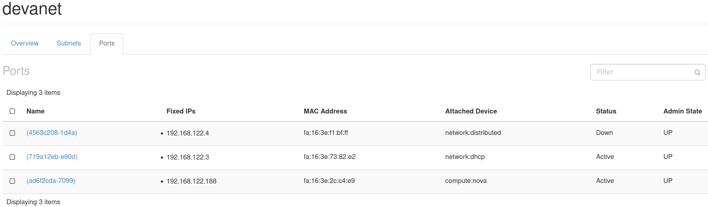

# Enable Domains

In Horizon, the Domains UI component seems to be inactive... First, you configure the Identity to be able to use the LDAP driver, add your own LDAP config, and enable the UI view in Horizon.

---

In `/etc/keystone/keystone.conf` add only the following:

```
[identity]
...
domain_specific_drivers_enabled = True
domain_config_dir = /etc/keystone/domains
```

In `/etc/keystone/domains/keystone.DEVANET.conf` add only the following:

```
[DEVANET]

[identity]
driver = ldap

[ldap]
url = ldap://ldap.devanet
user = cn=deva,dc=devanet
password = mysupersecurepassword
suffix = dc=devanet
user_tree_dn = dc=devanet
user_objectclass = inetOrgPerson
user_name_attribute = cn
```

Restart the Keystone service: `sudo systemctl restart keystone-wsgi-public.service`

Add the following to the Horizon Ansible Playbook `/etc/openstack_deploy/user_variables_horizon.yml` :

```
horizon_keystone_multidomain_support: True
```
Then, execute the Playbook, as this:
```
export SCENARIO='aio_metal_horizon_metal'
cd /opt/openstack-ansible
sudo openstack-ansible playbooks/os-horizon-install.yml 
```
This will succesfully configure Horizon and restart apache2. 

Login and grap the RC file and source it.

Now, logout, and the textfield for the domain input will appear. (there is a dropdown setting but it's not working at least on Firefox.)

## Basic initialization for Domains via CLI

1. Create `devanet` domain: `openstack domain create devanet`
2. Add the admin role to the default domain, _in order to be able to manage domains_: `openstack role add --domain default --user admin admin --insecure`
3. Add the admin role the devanet domain: `openstack role add --domain devanet --user admin admin --insecure` (NOTE: this cannot log in under devanet with the basic auth admin creds.)
4. List users under the `default` domain: `openstack user list --domain default --insecure`

## Test LDAP Connection

Firstly, LDAP must be configured on the ldap container instance as per [this](https://github.com/eosantigen/devanet/blob/main/docker/domain/ldap/README.md)

Try logging in as `eos.antigen` on domain `devanet` . It should say something like "_you have no permissions for this domain."_  . For this, login as `admin` under `default` domain and go to Identity -> Domains -> Set domain context (devanet) -> Manage Members -> it should be able to see the user `eos.antigen`, add it as `admin` to the domain `devanet`. So now you should be able to log back as `eos.antigen`.

# Networking (Non-Provider)

1. Create private net, not Shared, not External. Add a subnet to it, with DNS Name Servers `192.168.1.1` _(our base host DevaPC...)_

2. Create a public router for the External Network 'public' with default options. In it, add an `Internal Interface` **from the private net**.

It will look like this:


3. Launch some instance in the private network (always)...

4. Lastly, add a Floating IP (a one-to-one NAT) and bind it to your previously launched instance. 

## Connectivity to the private net

Because we haven't yet set up connectivity to the VM from the base host (`DevaPC/192.168.1.1`) via its Floating IP, then we can do the following:

Use the `os.devanet` / `192.168.122.2`, that hosts the all-in-one Openstack deployment, as a jump host!

`ssh -J os.devanet 172.29.249.145`

(If you've configured your ssh keys accordingly, the also add the flag `-A`, to do ssh-agent forwarding.)

The `os.devanet` has the appropriate routing information to locate your VMs in your private net.

---

- Internet connectivity: Works
- DNS resolution via our own dns container instance: Works like a charm


# Networking (Provider)

Based on this https://docs.openstack.org/neutron/zed/admin/deploy-ovs-provider.html

The following configuration is passed through the `openstack-aio.yaml` playbook, as well.

```ini
root@aio1:/etc/neutron# cat dhcp_agent.ini 

[DEFAULT]
interface_driver = openvswitch
enable_isolated_metadata = True
force_metadata = True
```

```ini
root@aio1:/etc/neutron# cat metadata_agent.ini
 
[DEFAULT]
nova_metadata_host = aio1
metadata_proxy_shared_secret = this-is-ever-changing-same-as-nova-conf
```

```ini
root@aio1:/etc/neutron# cat plugins/ml2/openvswitch_agent.ini 

[ovs]

bridge_mappings = provider:br-provider

[securitygroup]

enable_security_group = true
firewall_driver = openvswitch
```

```ini
root@aio1:/etc/neutron# cat plugins/ml2/ml2_conf.ini
# must contain the following, the rest output is excluded.
[ml2]
type_drivers = geneve,vlan,flat
tenant_network_types = geneve,vlan,flat
mechanism_drivers = ovn,openvswitch
extension_drivers = port_security
# ML2 flat networks

[ml2_type_flat]
flat_networks = provider
```

Connect the 'physical' base VM (the AIO host) interface to OVS:

`ovs-vsctl add-port br-provider enp0s3`

So, now, our OVS status is as follows:
```sh
root@aio1:/etc/neutron# ovs-vsctl show
b4f4e047-c2cb-4b2f-81c2-93d0083081c1
    Manager "ptcp:6640:127.0.0.1"
        is_connected: true
    Bridge br-int
        Controller "tcp:127.0.0.1:6633"
            is_connected: true
        fail_mode: secure
        datapath_type: system
        Port tap8059c295-dd
            tag: 4095
            trunks: [4095]
            Interface tap8059c295-dd
                type: internal
        Port int-br-provider
            Interface int-br-provider
                type: patch
                options: {peer=phy-br-provider}
        Port tapad6f2cda-70
            tag: 1
            Interface tapad6f2cda-70
        Port tap719a12eb-e8
            tag: 1
            Interface tap719a12eb-e8
                type: internal
        Port br-int
            Interface br-int
                type: internal
    Bridge br-provider
        Controller "tcp:127.0.0.1:6633"
            is_connected: true
        fail_mode: secure
        datapath_type: system
        Port enp0s3
            Interface enp0s3
        Port phy-br-provider
            Interface phy-br-provider
                type: patch
                options: {peer=int-br-provider}
        Port eth12
            Interface eth12
        Port br-provider
            Interface br-provider
                type: internal
    ovs_version: "2.17.8"
```
## Troubleshooting broken connectivity

The addition of the physical interface to OVS breaks connectivity to **192.168.122.2** from the DevaPC (**192.168.1.1**), since **enp0s3** becomes a slave to **ovs-system** ... so, following the first paragraph in the official [OVS doc](https://docs.openvswitch.org/en/latest/faq/issues/) , and based on the message through `systemctl restart systemd-networkd; systemctl status systemd-networkd` which states `enp0s3: Failed to set master interface, ignoring: Operation not supported` - then, to restore connectivity from DevaPC to aio1 VM, we must do:

```
ip addr flush dev enp0s3
ip addr add 192.168.122.2/24 dev br-provider
ip link set br-provider up
```
Because this needs to be done at every boot time, we can pass this config to a **netplan** config:

1. First disable the address given to enp0s3 - actually comment out the entire initial config:

```yaml
# cat /etc/netplan/00-installer-config.yaml 
# This is the network config written by 'subiquity'
# network:
#  ethernets:
#    enp0s3:
#      addresses:
#      - 192.168.122.2/24
#      nameservers:
#        addresses:
#        - 192.168.122.1
#        - 192.168.1.1
#        search:
#        - devanet
#      routes:
#      - to: default
#        via: 192.168.122.1
#  version: 2
```

2. Then, we need:

```yaml
# cat /etc/netplan/01-openvswitch-config.yaml 
network:
  ethernets:
    enp0s3: {}
  bridges:
    br-provider:
      interfaces: [enp0s3]
      openvswitch: {}
      addresses: [192.168.122.2/24]
      nameservers:
        addresses:
        - 192.168.122.1
        - 192.168.1.1
        search:
        - devanet
      routes:
      - to: default
        via: 192.168.122.1
  version: 2
```
3. Either `systemctl restart systemd-networkd` or solely `netplan apply`...

So, now , on the next reboot, we see on the Message of the Day text:

```
IPv4 address for br-provider: 192.168.122.2
```
And no address set for enp0s3! The route table has also been updated, with
```
default via 192.168.122.1 dev br-provider proto static 
```


**Key Neutron services**

When `/etc/neutron` config files are modified, then you need at some point to restart these services:
```sh
systemctl restart neutron-openvswitch-agent.service
systemctl restart neutron-metadata-agent.service
systemctl restart neutron-dhcp-agent.service
```
(depending on degraded services or no effect, then maybe, also is needed, `systemctl restart neutron-server`).

**Check on what's up:**


## Create the Provider-based flat network 'devanet' and test connectivity

Execute the scripts under **scripts/os** . It should look like this:




### Notes

Indeed, our running instance got the IP `192.168.122.188` (Compute:Nova) - which we are able to ping from the DevaPC. _(but not from within the os.devanet AIO host.)_

The Public network is not provider-based and is auto-created and can be disabled, by it's harmless to leave it like this for now.